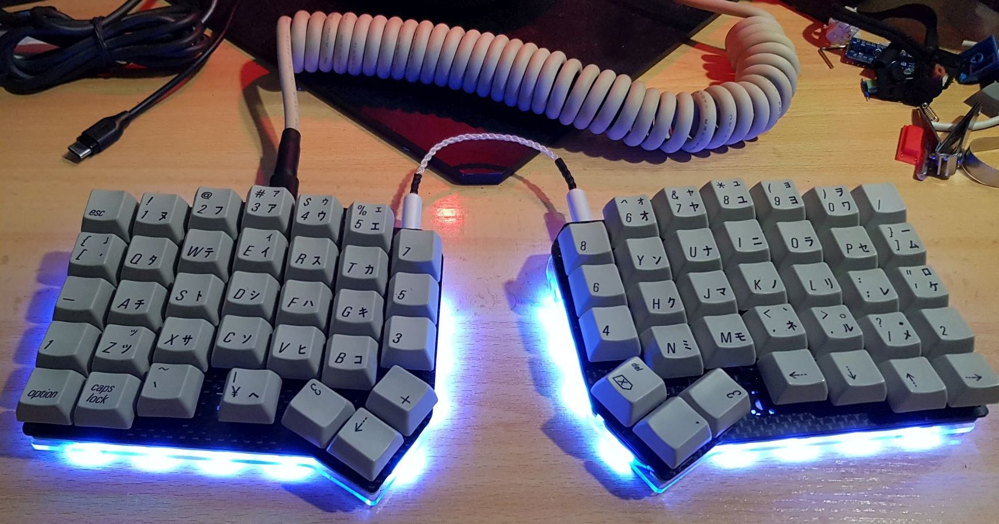
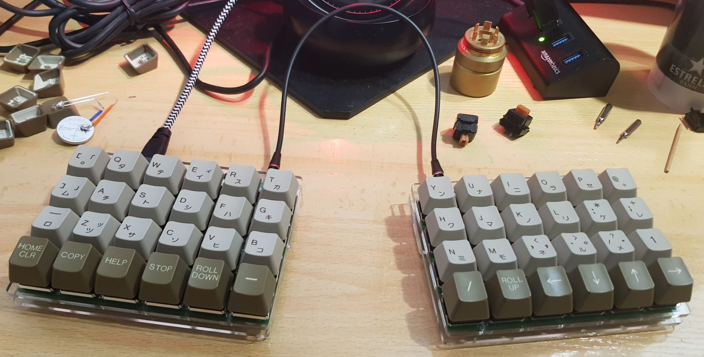
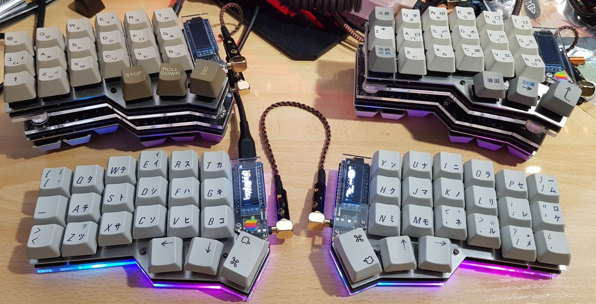

# Split Keyboard cases 

Modifications on some well known split keybord cases for my purposes
  - Top plates with Hybrid Cherry MX/Alps support
  - Top plates with Only Alps Support
  - Using a third plate to add tilt on the Let's Split and the Crkbd

## Ergodash

* Hybrid Cherry MX/Alps and Alps Only support top plates.
* Added clearance on the [top](images/ergodash_clearance_1.jpg) and [bottom/foot](images/ergodash_clearance_2.jpg) plates for a problematic screw.
* The top plate will work with the standard bottom/foot plates.

## Let's Split

* Hybrid Cherry MX/Alps and Alps Only support top plates.
* Extra [foot](images/lets_split_tilt.jpg) plate.
* The top plates will work with the standard bottom plate.

## Crkbd

* Hybrid Cherry MX/Alps and Alps Only support top plates.
* The top plates will work with the standard bottom plate.

# Links
* [Crkbd](https://github.com/foostan/crkbd) - The Crkbd keyboard and cases.
* [Ergodash](https://github.com/omkbd/ErgoDash) - The Ergodash keyboard and cases.
* [Let's Split!](https://github.com/keebio/lets-split-levinson-case) - Let's Split and Levinson case.

# Thanks
* To the original creators
* localhots and his [crkbd-alps](https://github.com/localhots/crkbd-alps) plate 
